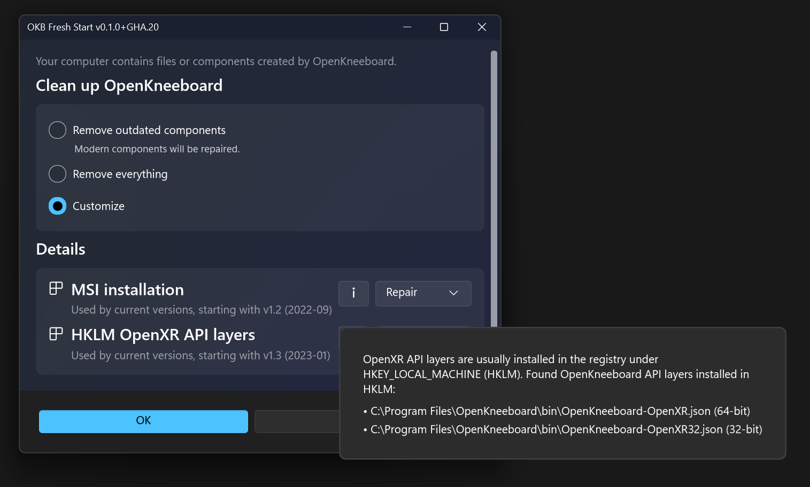

# OpenKneeboard Fresh Start

This is a tool to repair or remove OpenKneeboard.

It exists for a few reasons:

- Uninstallers should generally not remove your personal files or settings, only what was installed
- Microsoft imposes some limitations on MSI and MSIX installers and uninstallers that prevent a thorough uninstallation
- CMake switched between per-machine and per-user installations. These are separate, so it was possible to have two versions 'installed' at the same time, causing conflicts

## ⚠️ WARNING

If you use this tool to remove OpenKneeboard folders such as settings folders, the entire folder will be deleted, including both your settings and any other files you may have chosen to put in the settings folder.

## I just want to remove OpenKneeboard

Remove OpenKneeboard from add/remove programs. Don't use this tool.

## I've been using OpenKneebord for a while, and don't have any problems

If it ain't broke, don't fix it. Don't use this tool.

## Where do I download this?

Download the exe file from [the latest release](https://github.com/OpenKneeboard/Fresh-Start/releases/latest) on GitHub.

## I am having some problems that I think are caused by old OpenKneeboard stuff

Run this tool in the default mode, which removes outdated components and repairs other components.

## I use OpenKneeboard, and that wasn't good enough

Run this tool with the 'remove everything' mode, but don't tell it to remove your settings. Then, reinstall the latest version of OpenKneeboard.

## I want to delete my settings too, and start fresh

Do the same but tick the 'delete settings' box 🤷

## 🔥🔥🔥 KILL IT WITH FIRE 🔥🔥🔥

Download this tool, Select 'remove everything', and tick the box to also delete your settings.
